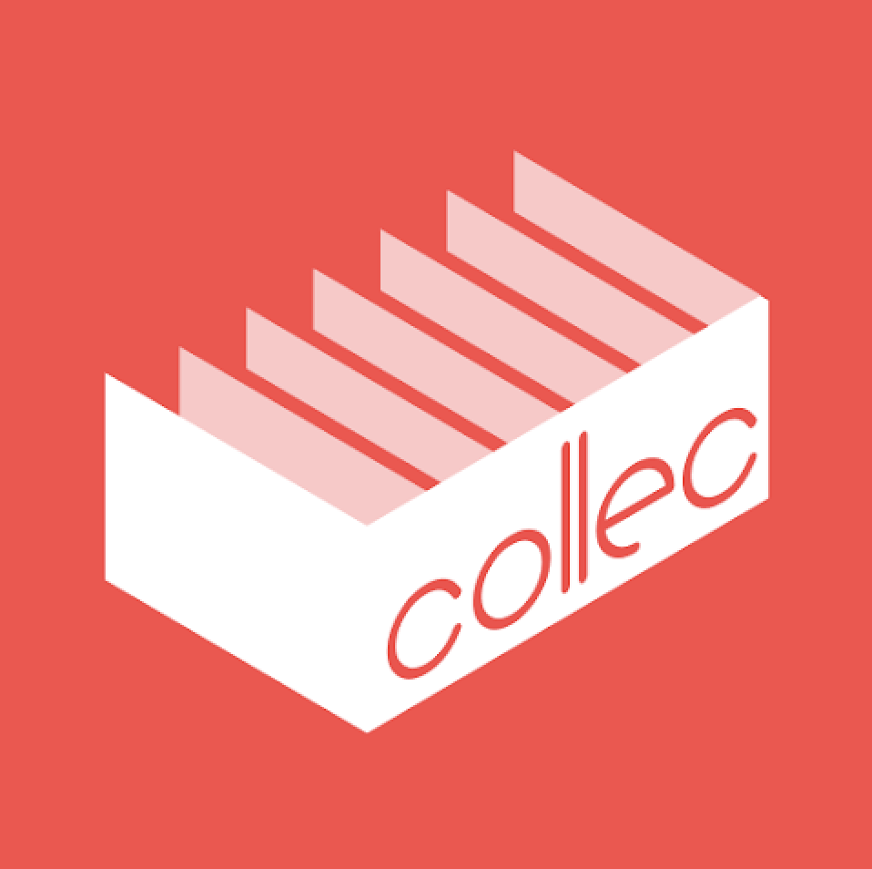
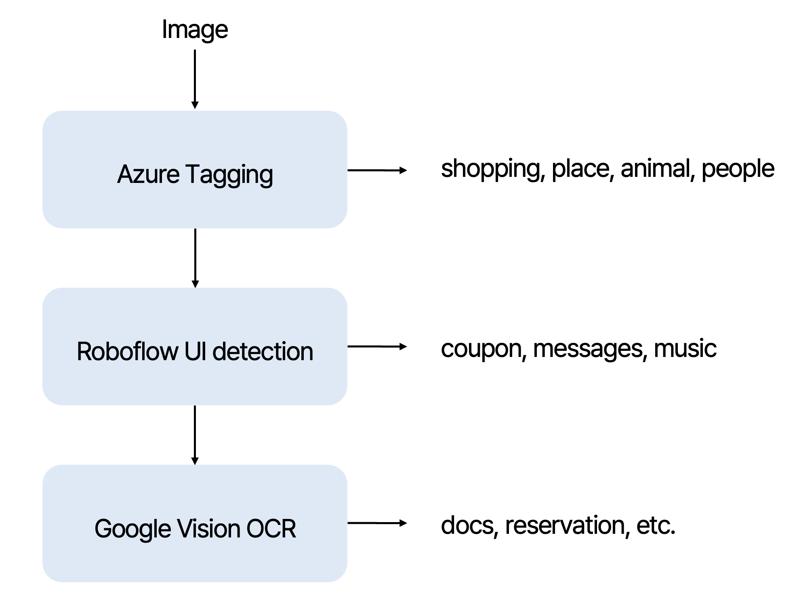

  

<h1> Collec </h1>

  
 **✨ A smarter way to organize your memories ✨  **
  Have you ever felt like organizing all those screenshots that pile up every day? 
  Collec is a dedicated screenshot organizer app that automatically categorizes your screenshots and helps you conveniently manage them by category.
  Organize your screenshots efficiently with a clean interface and AI technology, without the hassle of managing complex folders.   
  🚀 Now available in [Google playstore!](https://play.google.com/store/apps/details?id=com.collec.collecfe)

 

This repository contains the AI section of Collec code implementation.  
[**Jiyoon Jeon**](https://github.com/JuneJe0n) · [**Moon Jaewon**](https://github.com/lumiere-on) contributed to implementing the AI pipeline.

<h2> AI Pipeline </h2>

