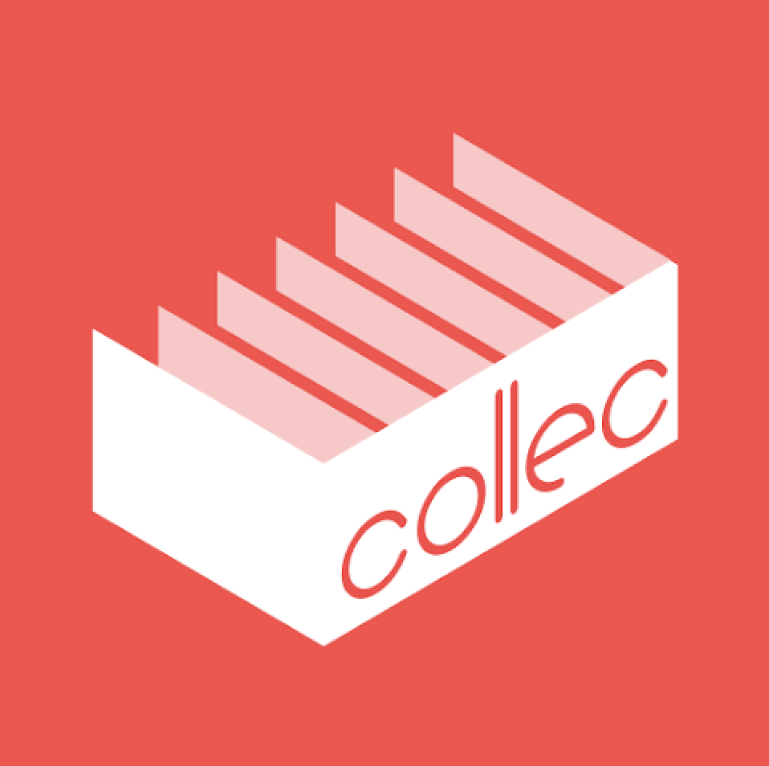
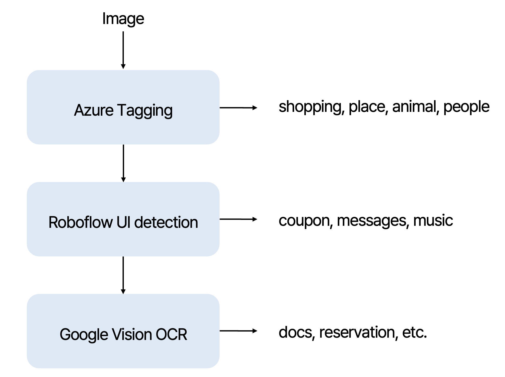

<p>
  
</p>
<h1> Collec </h1>

<div>
  
 **✨ A smarter way to organize your memories ✨<br><br>**
  Have you ever felt like organizing all those screenshots that pile up every day?<br>
  Collec is a dedicated screenshot organizer app that automatically categorizes your screenshots and helps you conveniently manage them by category.
  Organize your screenshots efficiently with a clean interface and AI technology, without the hassle of managing complex folders. <br><br>
  🚀 Now available in [Google playstore!](https://play.google.com/store/apps/details?id=com.collec.collecfe)
</div><br>

This repository contains the AI section of Collec code implementation. <br>
[**Jiyoon Jeon**](https://github.com/JuneJe0n) · [**Moon Jaewon**](https://github.com/lumiere-on) contributed to implementing the AI pipeline.

<h2> AI Pipeline </h2>


<h3> Task Definition</h3>
To design an effective screenshot organization system, we first collected real-world screenshots from team members and analyzed their distribution.

Through this analysis, we found that most screenshots can be grouped into the following 10 categories.  
Accordingly, our AI pipeline is designed to classify screenshots into these categories:

```
1. Shopping  
2. Place  
3. Animal  
4. Person  
5. Coupon (Gifticon)  
6. Chat (SMS, KakaoTalk, DM, etc.)  
7. Music
8. Document
9. Reservation
10. Others  
```

<h3>Pipeline Details </h3>

Deploying and maintaining a fully self-hosted AI model is financially challenging. Therefore, we decided to leverage external APIs instead of serving our own models.

However, no single public API supported our target task, **10 class screenshot classification**.  
To address this, we designed a **multi-stage pipeline that combines multiple APIs sequentially**.

The APIs we use were carefully selected based on task suitability  cost efficiency, performance, and compatibility within the overall pipeline.

<p></p>

<br><br>
**📍 [Stage 1] Azure Image Tagging**  [🔗](https://learn.microsoft.com/en-us/azure/ai-services/computer-vision/concept-tagging-images  )<br>
In the first stage, we use Azure Image Tagging to extract semantic tags from the input screenshot.

**Target Categories**
```
Shopping
Place
Animal
Person
```

**Method**<br>
Azure returns a list of tags with confidence scores for a given image:
```
{
   "tags":[
      {"name":"grass","confidence":0.9960},
      {"name":"outdoor","confidence":0.9956},
      {"name":"building","confidence":0.9893},
      {"name":"property","confidence":0.9853},
      {"name":"plant","confidence":0.9791},
      {"name":"sky","confidence":0.9764},
      {"name":"home","confidence":0.9732},
      {"name":"house","confidence":0.9726}
   ]
}
```

Through empirical analysis, we observed that certain categories consistently produce characteristic tags:
```
- Animal → animal, dog, cat, fluffy, etc.
- Place → building, outdoor, sky, etc.
- Person → person, face, human, etc.
- Shopping → product, clothing, fashion, etc.
```

We predefine a tag set for each category, and apply rule-based matching:
- If the predicted tags intersect with a category-specific tag set → classify into that category
- Otherwise → pass the image to the next stage

This stage efficiently filters out a large portion of simple, visually distinguishable categories with minimal cost.
<br><br>


**📍 [Stage 2] Roboflow Object Detection**  [🔗](https://roboflow.com/)<br>
In the second stage, we detect UI-specific patterns using a custom-trained object detection model on Roboflow.

**Target Categories**
```
Coupon (Gifticon)
Chat (SMS, KakaoTalk, DM, etc.)
Music
```

**Method**<br>
Unlike Stage 1, these categories are not defined by natural image content, but by distinct UI elements:
- Coupon → barcode
- Chat → speech bubbles
- Music → playback controls (play, pause, next, shuffle buttons, etc.)

We trained an object detection model to recognize the UI components using a 500 images per component. The images are half crawled and half manually captured by teammates.

The model predicts bounding boxes and class labels for these UI elements.
- If specific UI components are detected → classify into corresponding category
- Otherwise → pass to the next stage

This stage enables robust classification of interface-driven screenshots, which are difficult to handle with generic vision APIs.

<br><br>
**📍 [Stage 3] Google Vision OCR**  [🔗](https://docs.cloud.google.com/vision/docs/ocr)<br>
The final stage handles text-heavy screenshots using OCR.


**Target Categories**
```
Document
Reservation
Others
```

**Method**<br>
We extract text from the screenshot using Google Vision OCR and apply rule-based logic:
- If the amount of detected text exceeds a predefined threshold → classify as document
- If the text contains reservation-related keywords -> classify as r_eservation_
  ```
  ["예약", "예매", "티켓", "거래", "주문", "내역", "신용", "체크"]
  ```
- If none of the above conditions are met → classify as _others_


This stage ensures robust handling of text-dominant screenshots, which are common in real-world usage.


<h3>Summary</h3>

Our pipeline combines three complementary approaches:
- Semantic tagging (Stage 1) → natural image understanding
- Object detection (Stage 2) → UI pattern recognition
- OCR + rule-based logic (Stage 3) → text understanding

By cascading these stages, we achieve:
- High accuracy across diverse screenshot types
- Cost-efficient API usage
- Scalable and modular design


